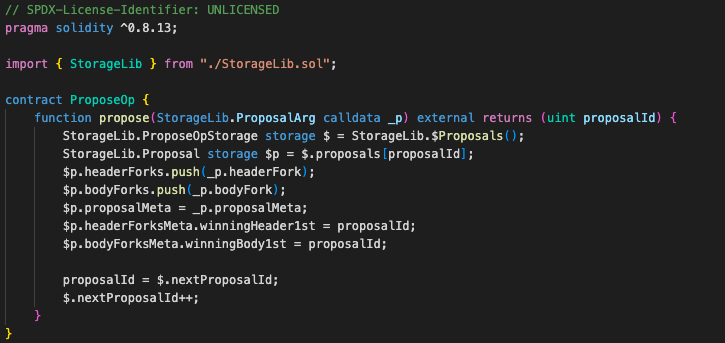
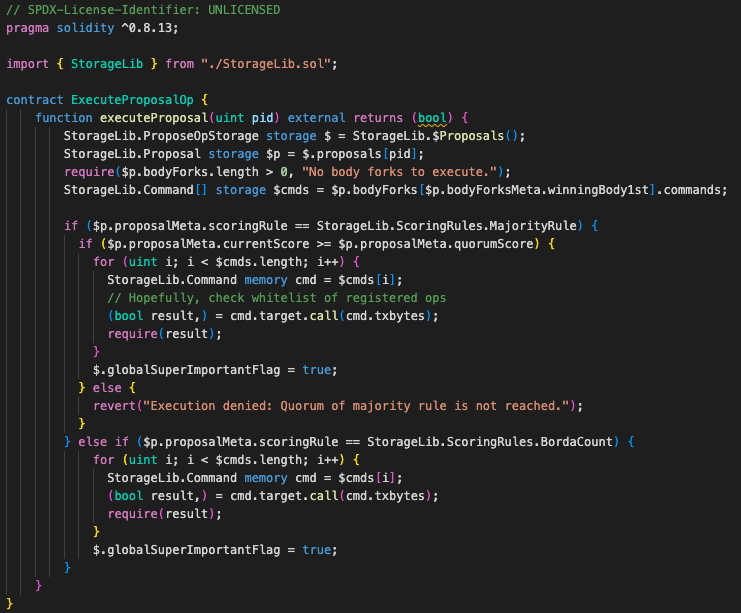
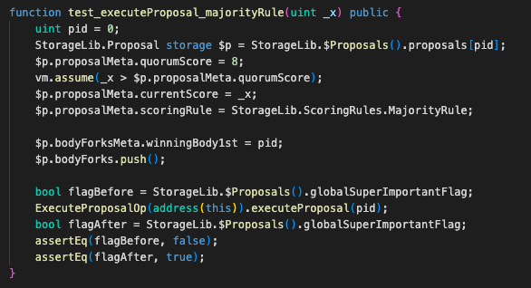
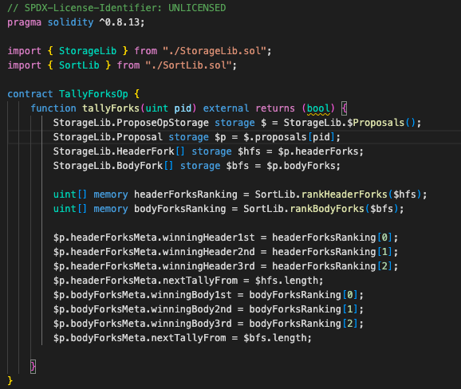
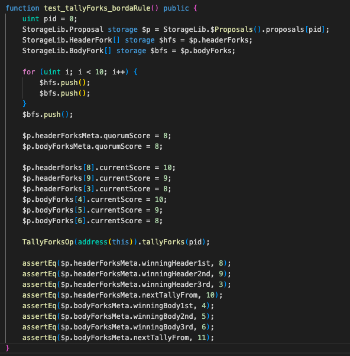

# ERC-7546 UCS TDD Example

## Overview
This project was born to solve unconfortable UUPS-based testing/devops experience.
[UCS](https://www.ecdysis.xyz/opensource/erc7546%3Aucs) is a reusable, maintainable, and testable design pattern for upgradeable smart contracts.

**The downside of UUPS testing are**
  - You must be proxy-concerned.
  - One-implementation, one proxy.
  - Hardhat.
  - "BigNumber"
  - Slow.
  - State preparation via complex scenario.

**The virtue of UCS testing are**
  - Just unit test functions.
  - No proxies within your sight.
  - Foundry.
  - Just simply write Solidity.
  - Fast.
  - [Fuzz-able state](https://mirror.xyz/shogochiai.eth/qw8PutYbxhm3g8FaW9g4NjKq14giC8jVtq_aMFOvkSU).
  - Each test case is loosely coupled, and changes will not be propagated.

## Status

### Intuitive and coflict-free state access

ProposeOp and MajorityVoteForProposal are sharing the same state. Functions can share their storage and you can treat UCS proxy as a singleton contract.

### Fuzzable state and faster test 

The fuzz test of ExecuteProposalOp has "fuzzable" prerequisite state.
This feature makes test faster because the total bytecodes which is generated by fuzzing feature is smaller unlike normal scenario testing.

### Code-size scallability and multi-tenancy

Upgradeable smart contracts are fat. It's upgrade logic is redundant and EVM's 24.576KB code size limit harnesses us to write great programs.

TallyForksOp example shows UCS is able to sustain several voting rule (even you can add token governance and quadratic voting!) in a singleton contract. You can even upgrade and clone such highly functional DAO proxies.

## Performance
- Commit [2ce217](https://github.com/shogochiai/erc7546ucs-tdd-example/tree/2ce21728bcb4fbccf6931517c4d0bddbbb84e50d) `forge test`, solc 0.8.23, 2 files
  - Compilation time: 5.43s
  - Test running time: 105.02ms
- Commit  `forge test`, solc 0.8.23, 8 files
  - Compilation time: 6.37s
  - Test running time: 110.27ms
- You won't need to browse X (Twitter) every time you run test :)

## Roadmap
- More example like "ve" and "AA"
